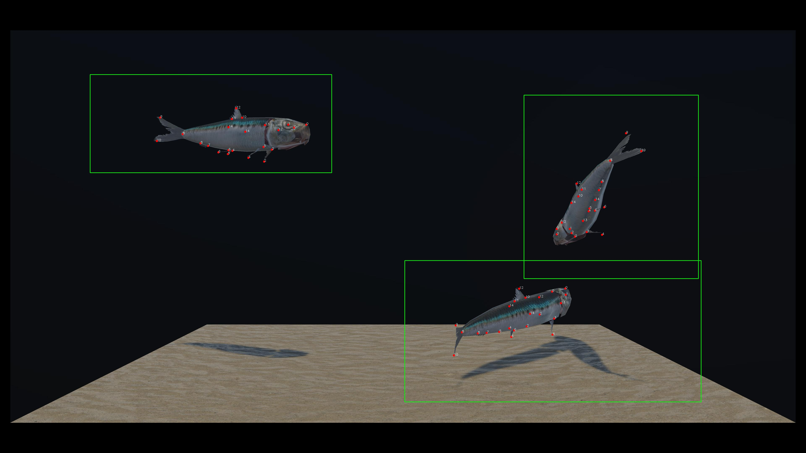
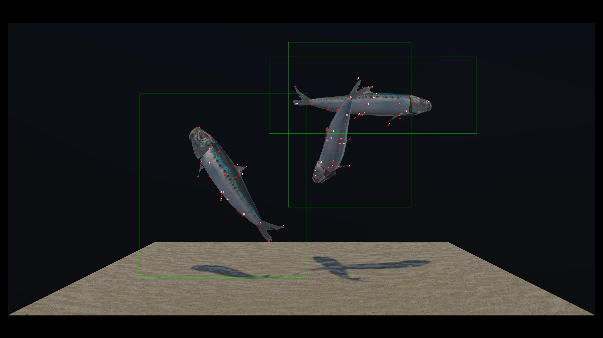
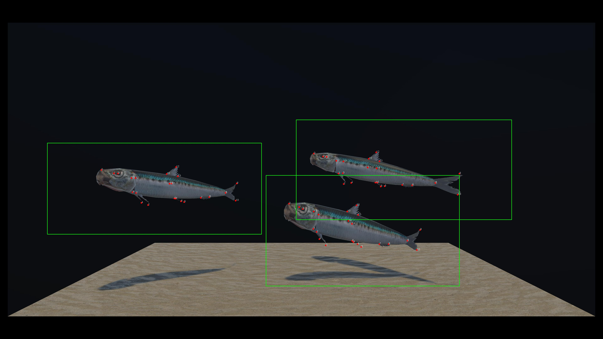
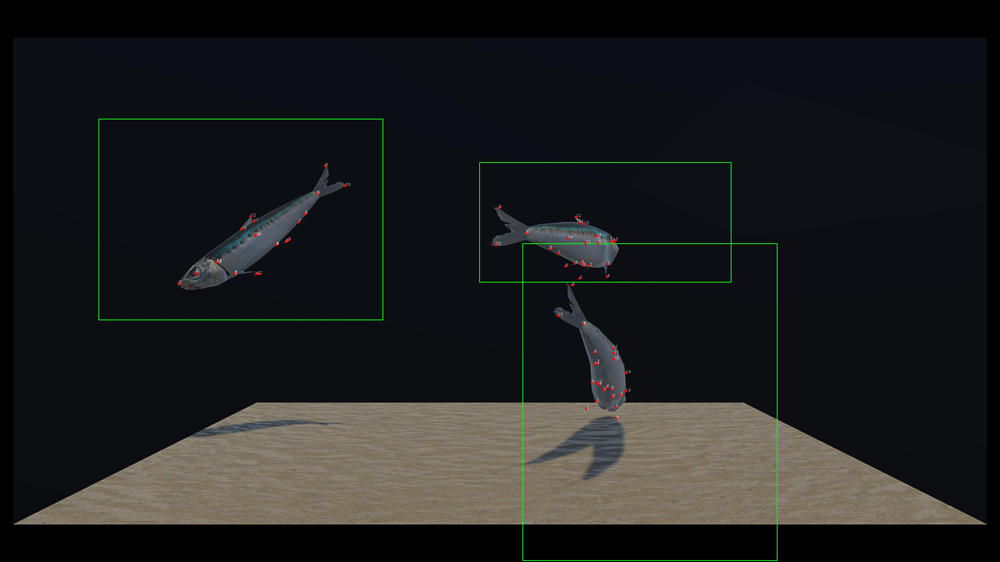

# Fish Individual Recognition using Computer Vision & Deep Learning


Ce projet vise à résoudre un défi complexe : **reconnaître individuellement des poissons quasiment identiques** (taille, couleur, forme) dans un aquarium en mouvement, en combinant computer vision et deep learning.

## 🛠️ Architecture de la Solution

1. **Génération de dataset synthétique** avec Unity pour l'annotation rapide
2. **Détection et pose estimation** avec YOLO
3. **Transformation des keypoints en masques** (profil/face)
4. **Classification individuelle** basée sur les morphologies subtiles

## 📦 Dataset

- **Annotations** : 23 keypoints anatomiques par poisson
- **Outils** : Génération procédurale sous Unity → *<b>YOLOPoseExporter.cs<b>*
- **Exemples d'annotation** :




## 🧠 Modèle YOLO pour Pose Estimation

### Configuration
- **Modèle** : YOLO11-pose (yolo11s-pose)
- **Keypoints** : 23 points anatomiques

    

- **Entrée** : 640x640 pixels

### Courbes d'apprentissage (400 epochs)


### Pose predictions


## ✨ Normalisation des Keypoints → Masques

Méthode convertissant les keypoints en masques pour capturer les subtilités morphologiques:

1. Alignement des points clés :
    - Profile → mouth - caudalStart
    - Face → leftEye - rightEye
2. Génération de silhouette
3. Normalisation perspective (longeur du poisson)

**Exemples de transformation** :
| Keypoints | Masque | Type de masque |
|-----------|---------------|------------|
|  |  | Profil |
|  |  | Profil |
|  |  | Face |
|  |  | Face |


## 🎯 Classification Individuelle

### Architecture :

Paramètres Globaux
| Paramètre | Valeur |
|-----------|---------------|
| Input Shape | (46,) |
| Nombre de Classes | 3 (3 poissons) |
| Optimiseur | Adam avec Cyclical Learning Rate |
| Taux d'apprentissage initial | 0.001 |
| Beta1 | 0.9 |
| Beta2 | 0.999 |
| Epsilon | 1e-7 |
| Fonction de Loss | sparse_categorical_crossentropy |

Schéma de l'Architecture
```
InputLayer(shape=(46,))
│
├─ Dense(256, activation='relu', kernel_initializer='he_normal')
├─ BatchNormalization()
├─ Dropout(0.2)
│
├─ [Bloc Résiduel 1]
│   ├─ Dense(256, activation='relu', L2=1e-5) → BatchNorm → Dropout(0.3)
│   ├─ Dense(256, activation='relu', L2=1e-5) → BatchNorm
│   └─ Add() + Dropout(0.3)  # Connexion résiduelle
│
├─ Dense(128, activation='relu', L2=1e-5) → BatchNorm → Dropout(0.35)
│
├─ [Bloc Résiduel 2]
│   ├─ Dense(128, activation='relu', L2=1e-5) → BatchNorm → Dropout(0.35)
│   ├─ Dense(128, activation='relu', L2=1e-5) → BatchNorm
│   └─ Add() + Dropout(0.35)  # Connexion résiduelle
│
├─ Dense(64, activation='relu', L2=1e-5) → BatchNorm → Dropout(0.4)
│
├─ [Tête de Classification]
│   ├─ Dense(32, activation='relu') → BatchNorm → Dropout(0.5)
│   └─ Dense(num_classes, activation='softmax')
│
Model: "Functional"
```

Caractéristiques Clés
1. Connexions Résiduelles

    - Deux blocs résiduels pour éviter le vanishing gradient.

    - Utilisation de Add() pour fusionner les entrées/sorties.

2. Régularisation

    - Dropout progressif (de 0.2 à 0.5).

    - L2 Regularization (1e-5) sur les couches denses.

    - Batch Normalization après chaque couche dense.

3. Optimisation

    - Adam avec des paramètres classiques (beta1, beta2).

    - Préparation pour un Cyclical Learning Rate (à implémenter via un callback).

### Face model
- **Metrics** :


- **Courbes d'apprentissage (436 epochs)** :


- **Matrice de confusion** :


### Profile model
- **Metrics** :


- **Courbes d'apprentissage (150 epochs)** :


- **Matrice de confusion** :


## 🚀 Utilisation

```bash
# Installation
pip install -r requirements.txt

# Inférence
python predict.py