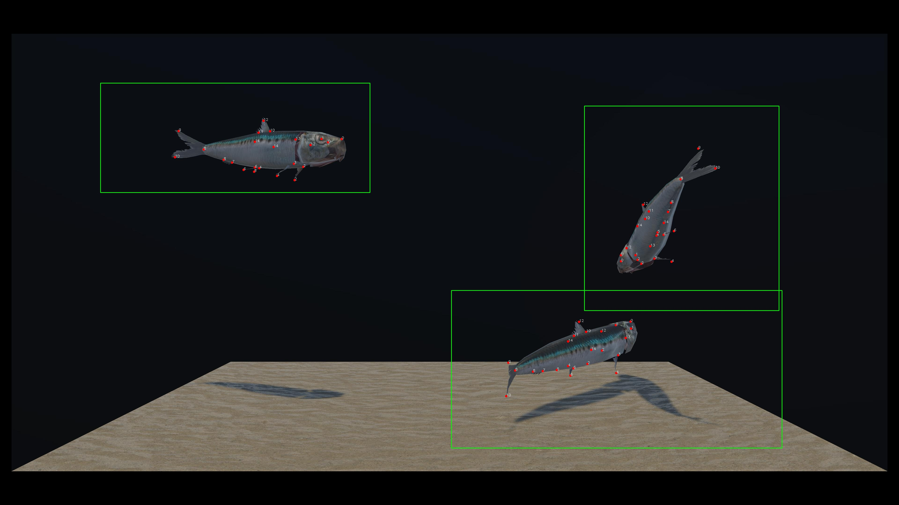
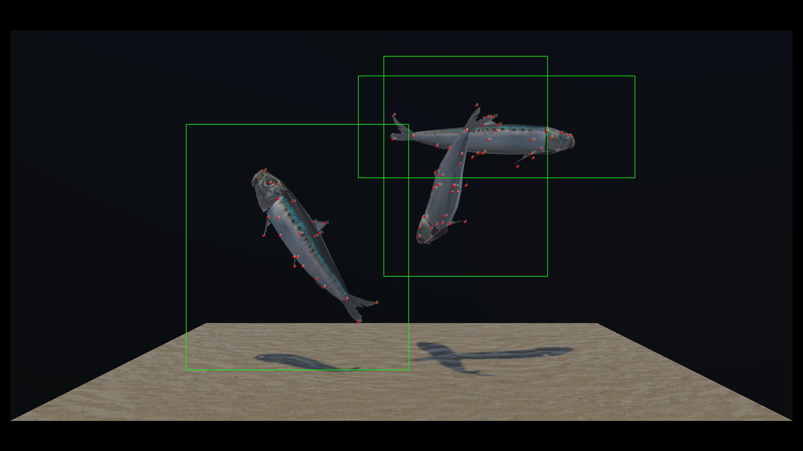
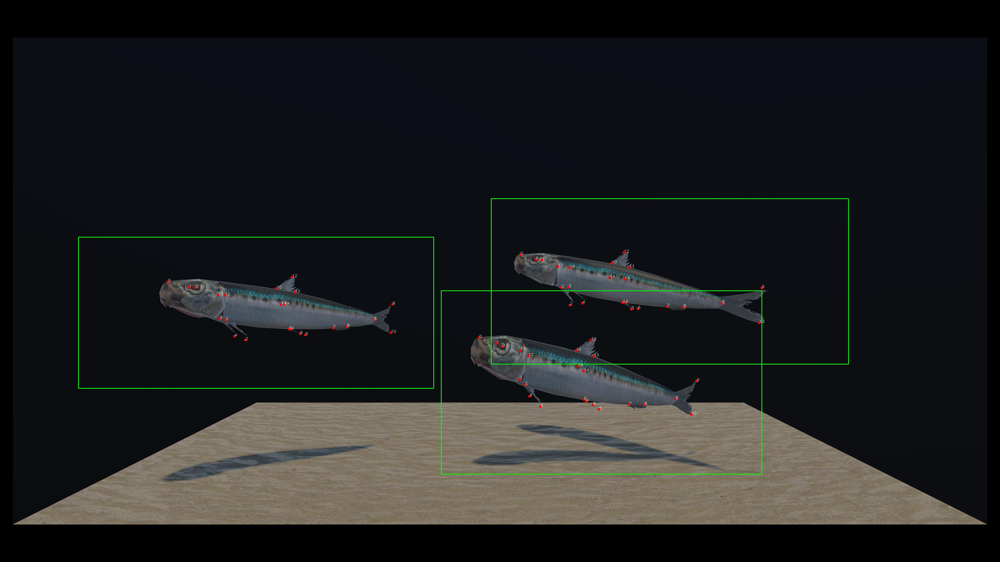
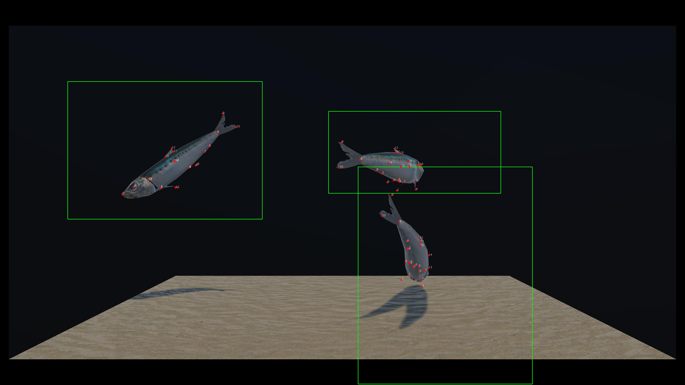

# Fish Individual Recognition using Computer Vision & Deep Learning


This project tackles a complex challenge: **individually recognizing nearly identical fish** (size, color, shape) in a moving aquarium by combining computer vision and deep learning.

## 🛠️ Solution Architecture

1. **Synthetic dataset generation** with Unity for fast annotation
2. **Detection and pose estimation** with YOLO
3. **Keypoint-to-mask transformation** (profile/face)
4. **Individual classification** based on subtle morphology

## 📦 Dataset

- **Annotations**: 23 anatomical keypoints per fish
- **Tools**: Procedural generation in Unity → **YOLOPoseExporter.cs**
- **Annotation examples**:




## 🧠 YOLO Model for Pose Estimation

### Configuration
- **Model**: YOLO11-pose (yolo11s-pose)
- **Keypoints**: 23 anatomical points

    

- **Input**: 640x640 pixels

### Learning curves (400 epochs)


### Pose predictions


## ✨ Keypoint Normalization → Masks

Method that converts keypoints into masks to capture subtle morphological differences:

1. Keypoint alignment:
    - Profile → mouth - caudalStart
    - Face → leftEye - rightEye
2. Silhouette generation
3. Perspective normalization (fish length)

**Transformation examples**:
| Keypoints | Mask | Mask type |
|-----------|---------------|------------|
|  |  | Profile |
|  |  | Profile |
|  |  | Face |
|  |  | Face |


## 🎯 Individual Classification

### Architecture:

Global Parameters
| Parameter | Value |
|-----------|---------------|
| Input Shape | (46,) |
| Number of Classes | 3 (3 fish) |
| Optimizer | Adam with Cyclical Learning Rate |
| Initial learning rate | 0.001 |
| Beta1 | 0.9 |
| Beta2 | 0.999 |
| Epsilon | 1e-7 |
| Loss Function | sparse_categorical_crossentropy |

Architecture Diagram
```
InputLayer(shape=(46,))
│
├─ Dense(256, activation='relu', kernel_initializer='he_normal')
├─ BatchNormalization()
├─ Dropout(0.2)
│
├─ [Residual Block 1]
│   ├─ Dense(256, activation='relu', L2=1e-5) → BatchNorm → Dropout(0.3)
│   ├─ Dense(256, activation='relu', L2=1e-5) → BatchNorm
│   └─ Add() + Dropout(0.3)  # Residual connection
│
├─ Dense(128, activation='relu', L2=1e-5) → BatchNorm → Dropout(0.35)
│
├─ [Residual Block 2]
│   ├─ Dense(128, activation='relu', L2=1e-5) → BatchNorm → Dropout(0.35)
│   ├─ Dense(128, activation='relu', L2=1e-5) → BatchNorm
│   └─ Add() + Dropout(0.35)  # Residual connection
│
├─ Dense(64, activation='relu', L2=1e-5) → BatchNorm → Dropout(0.4)
│
├─ [Classification Head]
│   ├─ Dense(32, activation='relu') → BatchNorm → Dropout(0.5)
│   └─ Dense(num_classes, activation='softmax')
│
Model: "Functional"
```

Key Features
1. Residual Connections

    - Two residual blocks to avoid vanishing gradients.

    - Uses Add() to merge inputs/outputs.

2. Regularization

    - Progressive dropout (from 0.2 to 0.5).

    - L2 regularization (1e-5) on dense layers.

    - Batch normalization after each dense layer.

3. Optimization

    - Adam with standard parameters (beta1, beta2).

    - Prepared for Cyclical Learning Rate (to be implemented via callback).

### Face model
- **Metrics**:


- **Learning curves (436 epochs)**:


- **Confusion matrix**:


### Profile model
- **Metrics**:


- **Learning curves (150 epochs)**:


- **Confusion matrix**:


## 🚀 Usage

```bash
# Installation
pip install -r requirements.txt

# Inference
python predict.py
